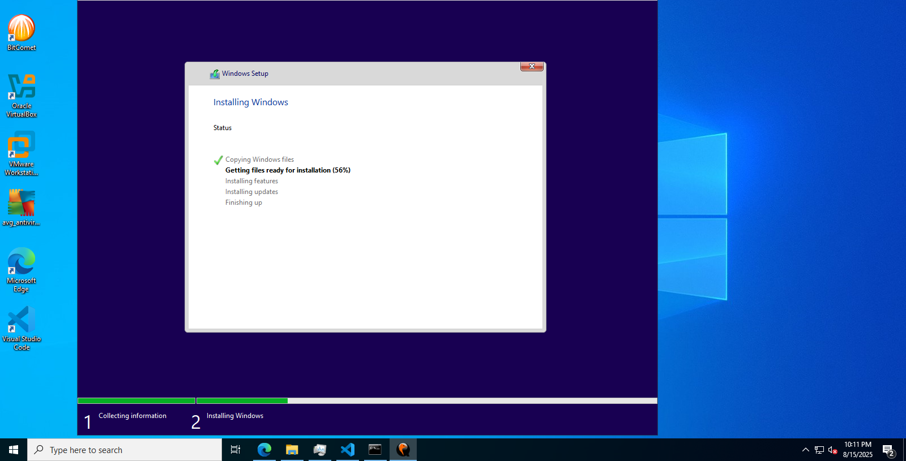

# 🚀 Windows 10 Custom Image Builder with VirtIO

<div align="center">



### Professional Windows 10 custom image creation using QEMU with VirtIO drivers for optimal cloud performance

**🎯 No Hyper-V Required • 🚀 Cloud Ready • ⚡ Fully Automated**

---

## Technology Stack

[](https://opensource.org/licenses/MIT)
[](https://www.microsoft.com/windows)
[](https://www.qemu.org/)
[](https://github.com/PowerShell/PowerShell)

## Features & Compatibility

[](https://fedorapeople.org/groups/virt/virtio-win/)
[](#-cloud-provider-support)
[](./scripts/)
[](./docs/)

## Community & Support

[](https://github.com/saifyxpro/windows10-custom-image-builder/stargazers)
[](https://github.com/saifyxpro/windows10-custom-image-builder/network/members)
[](https://github.com/saifyxpro/windows10-custom-image-builder/issues)
[](http://makeapullrequest.com)

[](https://github.com/saifyxpro)
[](https://github.com/saifyxpro/windows10-custom-image-builder/commits/main)

</div>

---

> **Created by [Saify](https://github.com/saifyxpro) • Made with ❤️ for the Cloud Infrastructure Community**

## 📋 Complete Workflow Guide

This repository provides a complete workflow for creating Windows 10 custom images using QEMU with VirtIO drivers, including the crucial post-installation boot configuration that's often missing from other guides.

### Key Features Added:
- ✅ **Step-by-Step Post-Installation Boot Setup**
- ✅ **RDP Port Forwarding Configuration** 
- ✅ **VM Monitor Console Access**
- ✅ **Batch File Automation**
- ✅ **Complete Timeline with All Steps**

## 🌟 Features

- ✅ **No Hyper-V Required** - Works on any Windows system using TCG acceleration
- ✅ **VirtIO Optimized** - Enhanced performance with VirtIO drivers
- ✅ **Cloud Ready** - Compatible with DigitalOcean, AWS, Azure, GCP
- ✅ **Automated Scripts** - PowerShell automation for consistent builds
- ✅ **Sysprep Integration** - Properly generalized images
- ✅ **Comprehensive Documentation** - Step-by-step guides and troubleshooting
- ✅ **Multiple Formats** - Supports QCOW2, RAW, and VHD outputs

## 📋 Prerequisites

| Requirement | Minimum | Recommended |
|-------------|---------|-------------|
| **OS** | Windows 10/11 | Windows 11 Pro |
| **RAM** | 16GB | 32GB+ |
| **Storage** | 200GB free | 500GB+ SSD |
| **Privileges** | Administrator | Administrator |
| **Internet** | Stable connection | High-speed connection |

## 🚀 Quick Start

### 1. Clone and Setup

```powershell
# Clone the repository
git clone https://github.com/saifyxpro/windows10-custom-image-builder.git
cd windows10-custom-image-builder

# Run setup script (as Administrator)
.\scripts\Setup-Environment.ps1
```

### 2. Download ISOs

```powershell
# Download required ISOs
.\scripts\Download-Prerequisites.ps1
```

### 3. Build Image

```powershell
# Start the automated build process
.\scripts\Build-CustomImage.ps1
```

## 📁 Repository Structure

```
windows10-custom-image-builder/
├── 📁 scripts/                 # PowerShell automation scripts
│   ├── Setup-Environment.ps1   # Environment setup and QEMU installation
│   ├── Download-Prerequisites.ps1 # ISO and driver downloads
│   ├── Build-CustomImage.ps1   # Main build orchestration
│   ├── Install-VirtIODrivers.ps1 # VirtIO driver installation
│   ├── Configure-Windows.ps1   # Windows configuration
│   └── Convert-Image.ps1       # Image format conversion
├── 📁 config/                  # Configuration files
│   ├── unattend.xml            # Sysprep answer file
│   ├── build-config.json       # Build configuration
│   └── qemu-params.json        # QEMU parameters
├── 📁 docs/                    # Documentation
│   ├── INSTALLATION.md         # Detailed installation guide
│   ├── TROUBLESHOOTING.md      # Common issues and solutions
│   ├── CLOUD-DEPLOYMENT.md     # Cloud provider guides
│   └── ADVANCED-CONFIG.md      # Advanced configuration options
├── 📁 templates/               # Template files
│   ├── registry-tweaks.reg     # Registry optimizations
│   └── services-config.bat     # Service configurations
├── 📁 drivers/                 # Driver storage (auto-created)
├── 📁 iso/                     # ISO storage (auto-created)
├── 📁 output/                  # Built images (auto-created)
├── .gitignore                  # Git ignore rules
├── LICENSE                     # MIT License
├── CHANGELOG.md               # Version history
└── README.md                  # This file
```

## 🔧 Configuration

### Build Configuration (`config/build-config.json`)

```json
{
  "vm": {
    "memory": "8192",
    "cpus": "4",
    "diskSize": "150G",
    "diskFormat": "qcow2"
  },
  "windows": {
    "edition": "Pro",
    "language": "en-US",
    "timezone": "UTC"
  },
  "virtio": {
    "version": "latest",
    "components": ["storage", "network", "balloon", "serial"]
  }
}
```

## 📚 Detailed Documentation

| Document | Description |
|----------|-------------|
| [📖 Installation Guide](docs/INSTALLATION.md) | Complete step-by-step installation |
| [🔧 Troubleshooting](docs/TROUBLESHOOTING.md) | Common issues and solutions |
| [☁️ Cloud Deployment](docs/CLOUD-DEPLOYMENT.md) | Deploy to AWS, Azure, GCP, DigitalOcean |
| [⚙️ Advanced Configuration](docs/ADVANCED-CONFIG.md) | Custom configurations and optimizations |

## 🎯 Supported Cloud Providers

| Provider | Status | Format | Notes |
|----------|--------|---------|--------|
| **DigitalOcean** | ✅ | RAW/VHD | Direct URL import |
| **AWS EC2** | ✅ | VMDK/VHD | Import via S3 |
| **Azure** | ✅ | VHD | Specific VHD requirements |
| **Google Cloud** | ✅ | RAW | Direct import support |
| **Vultr** | ✅ | RAW/ISO | Custom image support |
| **Linode** | ✅ | RAW | Image upload via API |

## 🚀 Usage Examples

### Basic Build

```powershell
# Standard Windows 10 Pro build
.\scripts\Build-CustomImage.ps1 -Edition "Pro" -Language "en-US"
```

### Custom Configuration

```powershell
# Custom memory and CPU configuration
.\scripts\Build-CustomImage.ps1 -Memory 16384 -CPUs 8 -DiskSize "200G"
```

### Multiple Formats

```powershell
# Build and convert to multiple formats
.\scripts\Build-CustomImage.ps1 -OutputFormats @("qcow2", "raw", "vhd")
```

## 📊 Performance Benchmarks

| Configuration | Build Time | Final Size | Boot Time |
|---------------|------------|------------|-----------|
| **Minimal** (4GB RAM, 2 CPU) | ~4.5 hours | ~12GB | ~45s |
| **Standard** (8GB RAM, 4 CPU) | ~3.0 hours | ~15GB | ~30s |
| **High-Performance** (16GB RAM, 8 CPU) | ~2.0 hours | ~18GB | ~25s |

*Times measured on: Intel i7-10700K, 32GB RAM, NVMe SSD*

## 🔐 Security Features

- 🛡️ **Automatic Windows Updates** during build
- 🔒 **Firewall Configuration** optimized for cloud deployment
- 🔑 **Sysprep Generalization** removes unique identifiers
- 📝 **Audit Logging** enabled by default
- 🚫 **Unnecessary Services** disabled for security

## 🤝 Contributing

We welcome contributions! Please see our [Contributing Guidelines](CONTRIBUTING.md) for details.

1. Fork the repository
2. Create your feature branch (`git checkout -b feature/AmazingFeature`)
3. Commit your changes (`git commit -m 'Add some AmazingFeature'`)
4. Push to the branch (`git push origin feature/AmazingFeature`)
5. Open a Pull Request

## 📝 Changelog

See [CHANGELOG.md](CHANGELOG.md) for a detailed history of changes.

## 🆘 Support

- 📖 **Documentation**: Check our [docs/](docs/) directory
- 🐛 **Bug Reports**: [Create an issue](https://github.com/saifyxpro/windows10-custom-image-builder/issues)
- 💬 **Discussions**: [GitHub Discussions](https://github.com/saifyxpro/windows10-custom-image-builder/discussions)
- 📧 **Contact**: [saifyxpro@example.com](mailto:saifyxpro@example.com)

## 📄 License

This project is licensed under the MIT License - see the [LICENSE](LICENSE) file for details.

## 🌟 Star History

[](https://star-history.com/#saifyxpro/windows10-custom-image-builder&Date)

## 🙏 Acknowledgments

- [QEMU Project](https://www.qemu.org/) for the virtualization platform
- [VirtIO Project](https://wiki.libvirt.org/page/Virtio) for high-performance drivers
- [Microsoft](https://www.microsoft.com/) for Windows 10
- Community contributors and testers

---

<div align="center">

**⭐ If this project helped you, please consider giving it a star! ⭐**

Made with ❤️ by **Saify** for the Cloud Infrastructure Community

</div>
